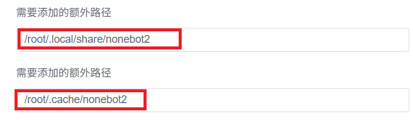

# Deploy

## Use NapCatQQ

<https://github.com/NapNeko/NapCatQQ>

### If use NapCatQQ Docker image

Additional path '/root/.cache/nonebot2' needs to be volume mounted.

## Use LLOneBot

<https://github.com/LLOneBot/LLOneBot>
